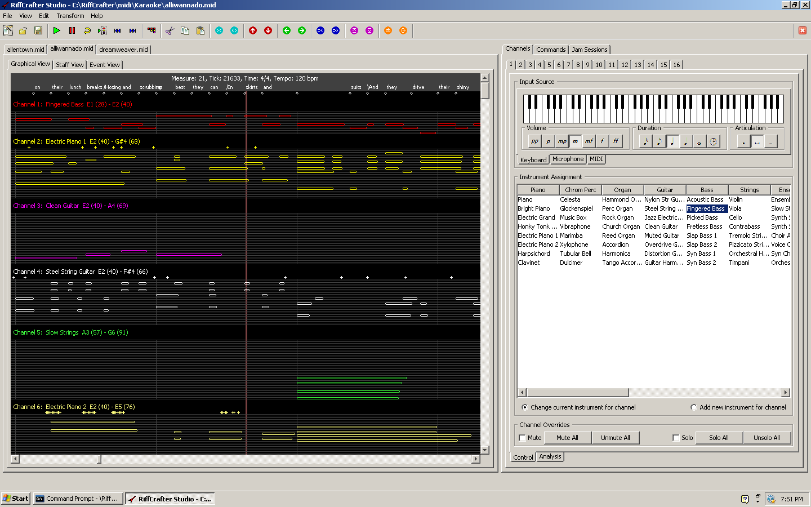
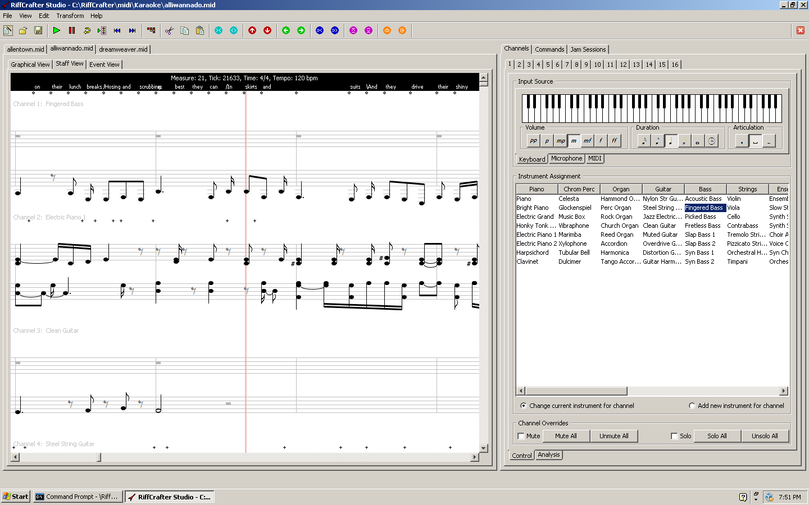
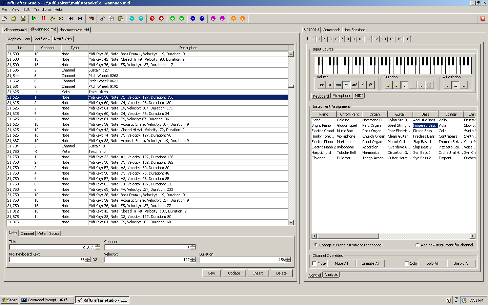
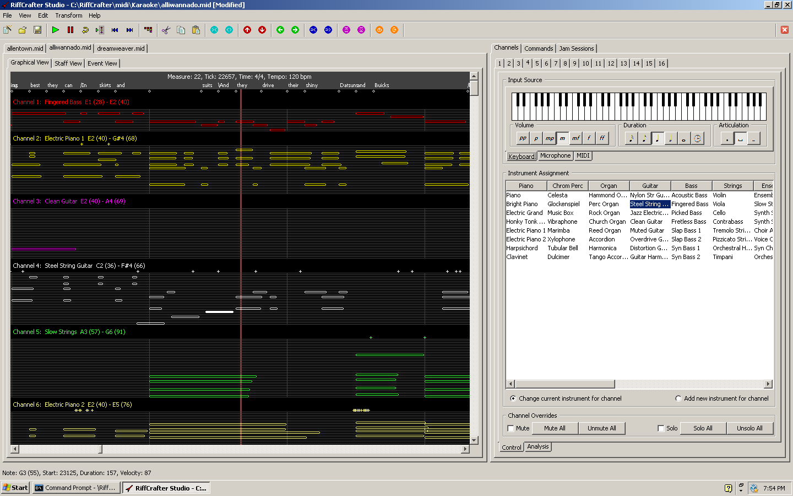
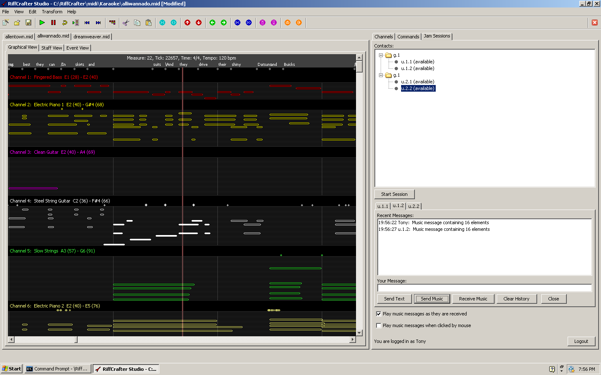
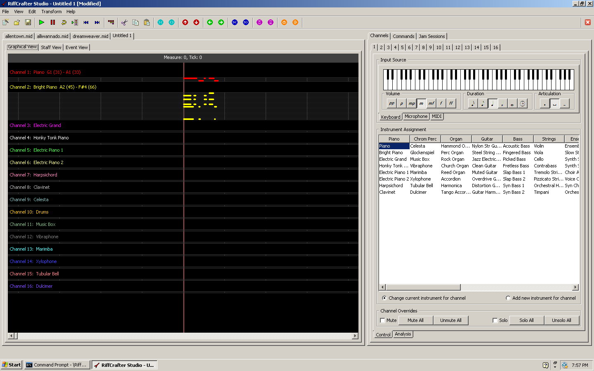

# Overview

RiffCrafter Studio lets you visualize, play, analyze, compose and edit music using MIDI files.

With RiffCrafter Studio, you can open an existing MIDI file or create a new one, then set up the instruments and add notes using the mouse, an on-screen keyboard, an attached MIDI device, or even by whistling or humming into a microphone. You can use the mouse to select and play groups of notes, change the instrument, increase or lower the pitch, or copy and paste groups of notes between MIDI files.

RiffCrafter Studio provides three ways to visualize the music: a graphical view where each note's pitch and duration are displayed relative to one another (like the paper scroll in an old fashioned player piano), a more conventional staff view, where each note is displayed on a piano-style grand staff, and a MIDI event view, where each musical event in the MIDI file is displayed as a row in a table. With each of these views, you can play or edit the music.

RiffCrafter Studio also provides a music analysis feature that lets you break down and view the musical structure. This makes it easy to detect and analyze thematic elements. You can break down the music by chords, chords and notes in a measures, musical phrases or by unique and repeating patterns detected by RiffCrafter Studio. For each thematic element, RiffCrafter Studio analyzes the notes and displays a list of possible keys.

# Graphical View

Here, we see the Graphical View. Each channel (instrument) in the MIDI file is a different color. With this view, you can easily see the relationships between notes, in terms of timing and pitch.

You can use the mouse to select and play a group of notes, or press the Play button to play the MIDI file. As the MIDI file plays, it scrolls to the left.

# Staff View

If you read music, you may find the Staff View useful. It uses the note pitch and timing information in the MIDI file to reconstruct a version of the original score. It is particularly useful for instruments that use the grand staff, such as the piano.

When you select a group of notes, they are highlighted and can be played, modified or copied to other channels or midi files.

With both the Staff View and the Graphical View, if the MIDI file contains lyrics, they are displayed, along with the current measure, tick (position), tempo and time signature. You you can hover the mouse over a note to display information about the note on the status line.

The Staff View scrolls to the left as the MIDI file plays. 

# Event View

If you want to understand the low-level technical details of a MIDI file, then the Event View is for you. It shows every MIDI message in the file, including notes, channel events, meta events and sysex events. With the Event View, you can update or delete existing events, or insert new events, like time signature or tempo.

Notes that you select in the Graphical or Staff Views are highlighted in the Event View, and vice-versa.

The Event View scrolls up as the MIDI file plays.

# Analyzer

If you're interested in music theory, check out the Analyzer. It's on the right, and works with any of the views. The Analyzer window consists of three sections: the Structure Analyzer, the Key Analyzer, and current settings.

You can switch between the Control and Analysis views using the tabs on the bottom right. These views have one tab for each channel (i.e. 1 through 16). These tabs correspond to the 16 channels that are displayed in the Graphical, Staff or Event views.

With the Structure Analyzer, you can see notes, chords, measures, and unique or repeating patterns (e.g. verse, chorus, bridge). When you select an item in the structure analyzer, the corresponding notes play in the view, and vice-versa.

The Key Analyzer shows the relationships between the notes you've selected in the structure analyzer, and determines which key the notes may be in, based on a scoring of the number of accidentals, tonic triads and tonic thirds.

# Microphone Input

The top right corner of the screen contains the input tabs. Here we see the tab for microphone input, which uses a Fast Fourier Transform (FFT) to convert sound pressure (audio) to pitch (notes). These notes can then be saved in a MIDI file. The quality of the result depends on many factors, some of which are very hard to control. This is an experimental feature and you may want to modify the source code to try various alternatives. You can also experiment with the Sensitivity, Clip and Duration sliders that are present on this tab.

# MIDI Input

The MIDI input tab lets you connect a MIDI controller, such as a piano keyboard or drum pads, to RiffCrafter. The MIDI Input Device drop down displays a list of available midi devices. If you plug in a new device, press the Refresh Device List button so that the device will appear in the list.

# Keyboard Input

The default input source is the onscreen keyboard. You can click the keys with the mouse. The Volume, Duration and Articulation buttons let you control how the notes are added to the current MIDI channel.

# Commands

As an alternative to the keyboard, MIDI and microphone input methods, you can add notes to a MIDI file using character based commands. This gives you a lot of control over the music by letting you explicitly specify location, channel, note, velocity (loudness), duration and many other properties.

# Jam Sessions

With the Jam Sessions tab (on the far right), you can use instant messaging to send and receive messages and riffs.

To start a Jam Session, click the Jam Sessions tab, select an instant messaging provider and log in with your existing ID and password. Once you're logged in, you'll see your existing friends list. Select one or more IDs from your friends list, and you've got a jam session. You can start multiple sessions, with multiple friends in each session.

You can send messages, select and send riffs, receive riffs, and save them into a MIDI file.

# Making Music

To create something new, just click the "New" toolbar button on the left or select the File -> New menu item. Then copy and paste existing notes from existing files, or add new notes using the onscreen keyboard, microphone, MIDI or command input methods.

You've got dozens of instruments to experiment with, as well as plenty of menu items that let you do things like increase or decrease the pitch, or move notes from one channel (instrument) to another. You can also use the control features on the right to mute or solo one or more channels.

# More on the Musical Instrument Digital Interface (MIDI)

You may be wondering how a MIDI file differs from an audio music file, like an MP3.

A MIDI file contains a series of messages (also known as events) that describe the actions of one or more musicians. These are things like pressing or releasing a key on a piano keyboard.

A MP3 file, on the other hand, just contains the resulting audio waveform. This makes it is easy to go from a MIDI file to an MP3, but very difficult to go the other way.

It's kind of like describing the brush strokes of a painter versus the resulting painting. 

MIDI music quality is largely dependent on the quality of the sound font that the MIDI synthesizer uses to produce the resulting audio. RiffCrafter uses the current Java sound font, which is usually relatively low quality. For other alternatives, search the web for Java sound font.
